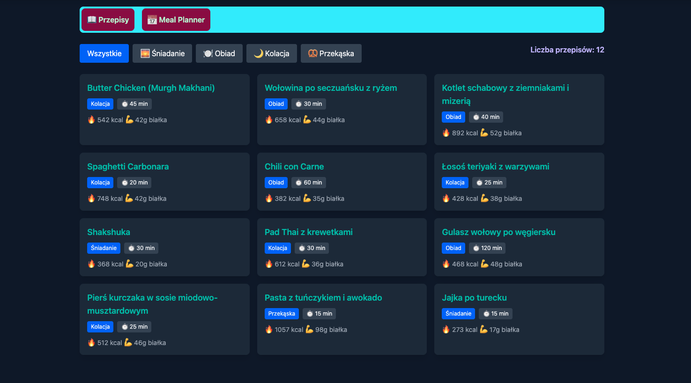
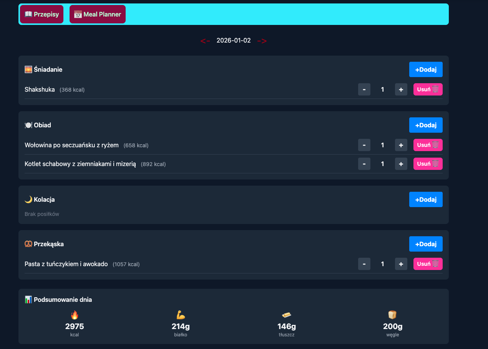
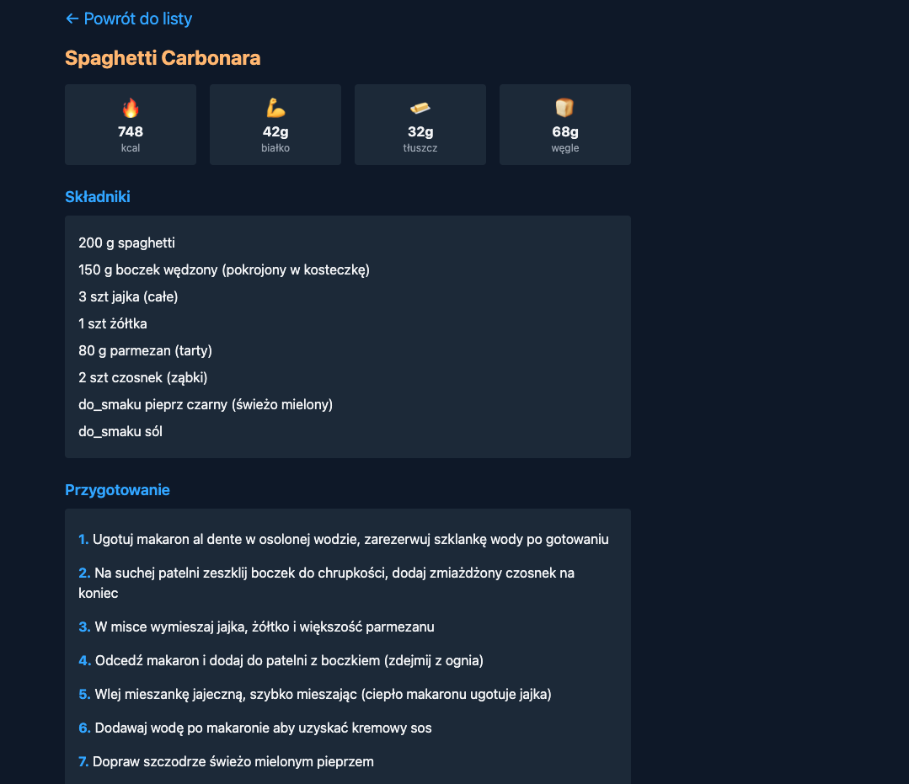

# RecipesApp

A full-stack meal planning application for storing recipes, planning daily meals, and tracking nutritional intake.

### Recipe List



_Browse all recipes with category filters (Breakfast, Lunch, Dinner, Snack)_

### Meal Planner



_Plan your daily meals and see total macro summary_

### Recipe Detail



_View ingredients, instructions, and nutritional info per serving_

## Features

- **Recipe Management** - Create, view, and delete recipes with full CRUD operations
- **Meal Planning** - Add recipes to daily meal plans with adjustable servings
- **Nutrition Tracking** - Automatic calculation of calories, protein, fat, and carbs
- **Category Filtering** - Filter recipes by meal type (breakfast, lunch, dinner, snack)
- **Internationalization (i18n)** - Full English/Polish language support with runtime switching
- **Responsive UI** - Mobile-friendly design with Tailwind CSS

## Tech Stack

| Layer    | Technology                       |
| -------- | -------------------------------- |
| Backend  | Python 3.10+, Flask              |
| Frontend | Vanilla JavaScript (ES6 Modules) |
| Database | SQLite                           |
| Styling  | Tailwind CSS                     |

## Architecture

### Backend (REST API)

The backend follows a **modular blueprint architecture**:

- `routes/recipes.py` - Recipe CRUD endpoints
- `routes/meal_plans.py` - Meal planning endpoints
- `routes/statistics.py` - Analytics endpoint

### Frontend (Vanilla JS)

The frontend uses **ES6 modules** for code organization:

- `app.js` - Main application logic and UI rendering
- `api.js` - API client module (fetch wrapper)
- `modal.js` - Reusable modal component
- `i18n.js` - Internationalization module

### Key Patterns Used

- **Event Delegation** - Single global click handler for all UI actions
- **Module Pattern** - Separation of concerns (API, UI, i18n)
- **Observer Pattern** - Language change subscriptions in i18n module
- **Client-side Caching** - Recipe data cached to reduce API calls

## API Endpoints

| Method | Endpoint                | Description                                     |
| ------ | ----------------------- | ----------------------------------------------- |
| GET    | `/api/recipes`          | List all recipes (optional `?category=` filter) |
| GET    | `/api/recipes/:id`      | Get recipe with ingredients                     |
| POST   | `/api/recipes`          | Create new recipe                               |
| DELETE | `/api/recipes/:id`      | Delete recipe                                   |
| GET    | `/api/meal-plans?date=` | Get meal plan for date                          |
| POST   | `/api/meal-plans`       | Add meal to plan                                |
| PATCH  | `/api/meal-plans/:id`   | Update servings                                 |
| DELETE | `/api/meal-plans/:id`   | Remove meal from plan                           |
| GET    | `/api/statistics`       | Get recipe count                                |

## Project Structure

```
RecipesApp/
├── backend/
│   ├── app.py                 # Flask application entry point
│   ├── database.py            # SQLite connection manager
│   ├── schema.sql             # Database schema
│   ├── import_recipes.py      # Recipe import utility
│   └── routes/
│       ├── recipes.py         # Recipe CRUD endpoints
│       ├── meal_plans.py      # Meal planning endpoints
│       └── statistics.py      # Statistics endpoint
├── frontend/
│   ├── index.html             # Single page application
│   ├── css/
│   │   └── styles.css         # Custom animations
│   └── js/
│       ├── app.js             # Main application logic
│       ├── api.js             # API client module
│       ├── modal.js           # Modal component
│       ├── i18n.js            # Internationalization module
│       └── locales/
│           ├── en.json        # English translations
│           └── pl.json        # Polish translations
├── data/
│   └── recipes.json           # Sample recipe data
├── docs/
│   └── recipe-prompt.md       # AI prompt for recipe formatting
└── requirements.txt
```

## Getting Started

### Prerequisites

- Python 3.10+

- pip

### Installation

```bash

# Clone the repository

git clone https://github.com/Mazzi2000/RecipesApp

cd RecipesApp


# Install dependencies

pip install -r requirements.txt


# Initialize the database

cd backend

python database.py


# Import sample recipes (optional)

python import_recipes.py


# Run the app

python app.py

```

The app will be available at `http://127.0.0.1:5000`

## 🤖 Adding Recipes (AI-Assisted Workflow)

This app uses a clever workflow to convert messy recipes into structured data:

1. Collect recipes from any source (Instagram, websites, notes)
2. Use ChatGPT/Claude with the prompt in `docs/recipe-prompt.md`
3. Save output to `data/recipes.json`
4. Run `python import_recipes.py`

The AI automatically categorizes meals, calculates nutrition, and standardizes formats.

### Manual

Use the "Add Recipe" button in the UI to create recipes with ingredients and instructions.

## Internationalization

The app supports multiple languages with runtime switching:

- **Default**: English
- **Available**: English, Polish
- **Storage**: Language preference saved in localStorage
- **Implementation**: Custom i18n module with JSON translation files

  Switch language using the flags in the header (EN/PL).

## Status

🚧 Learning project - actively developed
