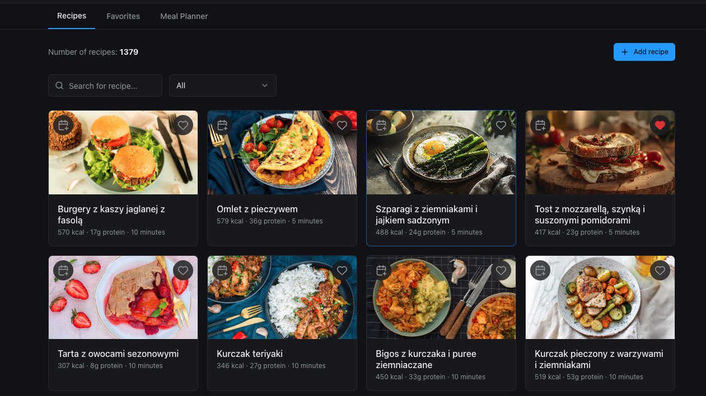
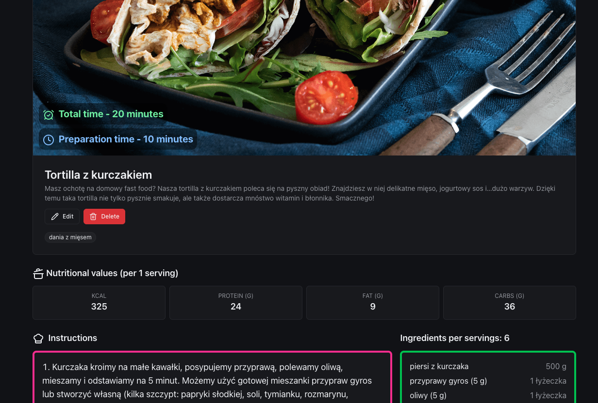
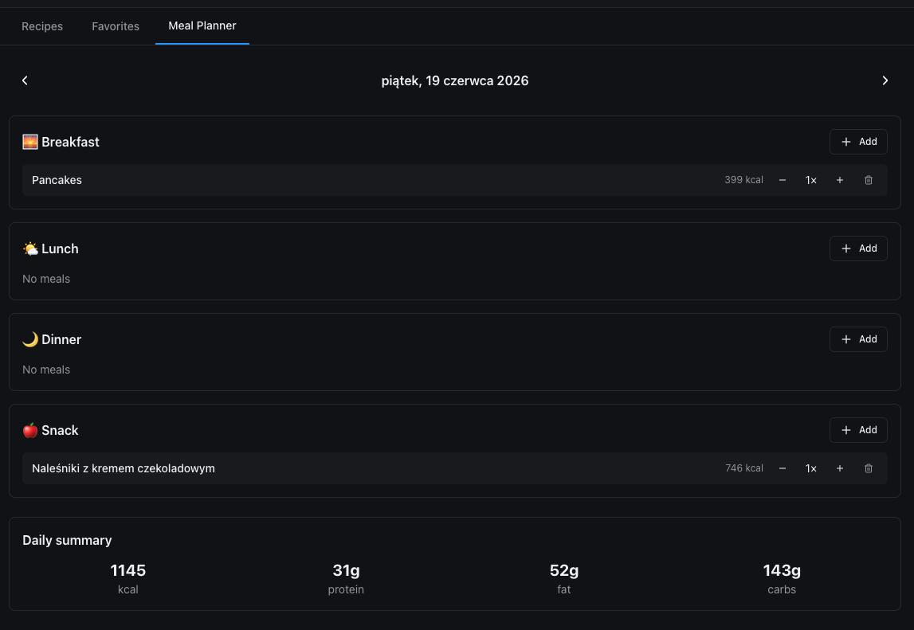

# RecipesApp

A small full-stack web app for storing recipes, planning daily meals, and keeping
an eye on calories and macros (protein, fat, carbs). It began as a learning project
and is now used privately by a small group of friends and family.

The app is invite-only — there is no public sign-up, and you need an account to use
almost everything, app is avaiable online.

---

## Screenshots

<!-- SCREENSHOT 1 of 3 — Recipe list / home page -->

*Browse all recipes and filter by meal type.*

<!-- SCREENSHOT 2 of 3 — A single recipe's detail page -->

*Ingredients, instructions, and per-serving nutrition.*

<!-- SCREENSHOT 3 of 3 — The meal planner -->

*Plan a day's meals and see the macro totals add up automatically.*

---

## What it does

- **Recipe library** — create, edit, delete, search, and filter recipes by meal
  type (breakfast, lunch, dinner, snack). Each recipe holds ingredients,
  instructions, an optional photo, nutrition info, and free-form tags.
- **Meal planner** — drop recipes into a day's breakfast/lunch/dinner/snack slots
  with adjustable serving sizes; the app sums the macros for you.
- **Favorites** — each user has their own favorites (they don't show up to others).
- **Nutrition tracking** — calories, protein, fat, and carbs per serving.
- **Bilingual interface** — every label and message exists in English and Polish,
  switchable on the fly with the EN/PL buttons in the header.
- **Login required** — accounts are created from the command line on the server;
  there is no public registration.

---

## Tech stack

| Layer    | Technology                                                                 |
| -------- | -------------------------------------------------------------------------- |
| Backend  | Python 3.10+, Flask, Flask-Login, Flask-Limiter, SQLite, Gunicorn          |
| Frontend | React 19, TypeScript, Vite, TanStack Query, React Router, Tailwind CSS v4, Radix UI, i18next |
| Infra    | AWS EC2 (Ubuntu 24.04), nginx, systemd                                     |
| CI/CD    | GitHub Actions (lint, tests, build, automatic deploy)                      |

> There are two frontends in the repo. `frontend-react/` is the live one.
> `frontend/` is the original vanilla-JS UI, kept only as a fallback and no longer
> maintained.

---

## Project structure

```
RecipesApp/
├── backend/                # Flask API
│   ├── app.py              # entry point + blueprint registration
│   ├── database.py         # SQLite connection + init
│   ├── schema.sql          # database schema
│   ├── create_user.py      # CLI: add a user account
│   ├── import_recipes.py   # load the sample recipe data
│   ├── routes/             # API endpoints (recipes, meal_plans, auth, favorites, statistics)
│   └── tests/              # pytest API tests
├── frontend-react/         # React + TypeScript app (the live UI)
│   └── src/
├── frontend/               # legacy vanilla-JS UI (fallback only)
├── data/recipes.json       # sample recipe data
├── .github/workflows/      # CI/CD pipeline
└── requirements.txt
```

---

## Running it locally

You'll need **Python 3.10+**, **Node.js 20+**, and **Git**.

**1. Clone and set up the Python environment**

```bash
git clone https://github.com/Mazzi2000/RecipesApp
cd RecipesApp
python3 -m venv venv
source venv/bin/activate          # Windows: venv\Scripts\activate
pip install -r requirements.txt
```

**2. Create a `.env` file with a real secret key**

```bash
echo "SECRET_KEY=$(python3 -c 'import secrets; print(secrets.token_hex(32))')" > .env
echo "FLASK_DEBUG=1" >> .env
```

The `SECRET_KEY` signs login sessions. Keep it private and never commit `.env`
(it's already in `.gitignore`).

**3. Create the database and a user**

```bash
cd backend
python3 database.py                       # creates an empty recipes.db
python3 create_user.py yourname yourpass  # your login
python3 import_recipes.py                 # optional: load sample recipes
cd ..
```

**4. Start the backend** (terminal 1)

```bash
FLASK_DEBUG=1 python3 backend/app.py       # runs at http://127.0.0.1:5000
```

**5. Start the frontend** (terminal 2)

```bash
cd frontend-react
npm install                                # first time only
npm run dev                                # runs at http://localhost:5173
```

Open http://localhost:5173 and log in with the account you made in step 3. Vite
proxies `/api/*` to the backend automatically, so the two halves talk to each other.

---

## Tests

```bash
# Backend
cd backend
pip install -r requirements-dev.txt
pytest

# Frontend
cd frontend-react
npm test
```

---

## Status

Active learning project, used privately. Not intended as a public, multi-user
service.